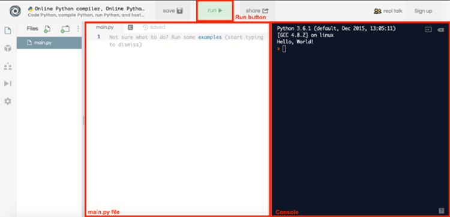
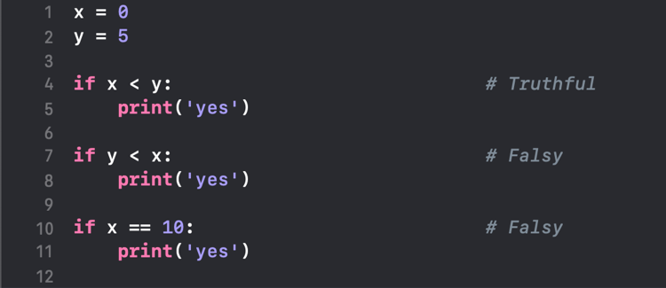
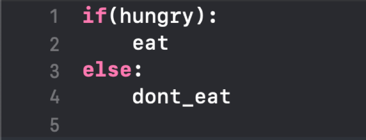
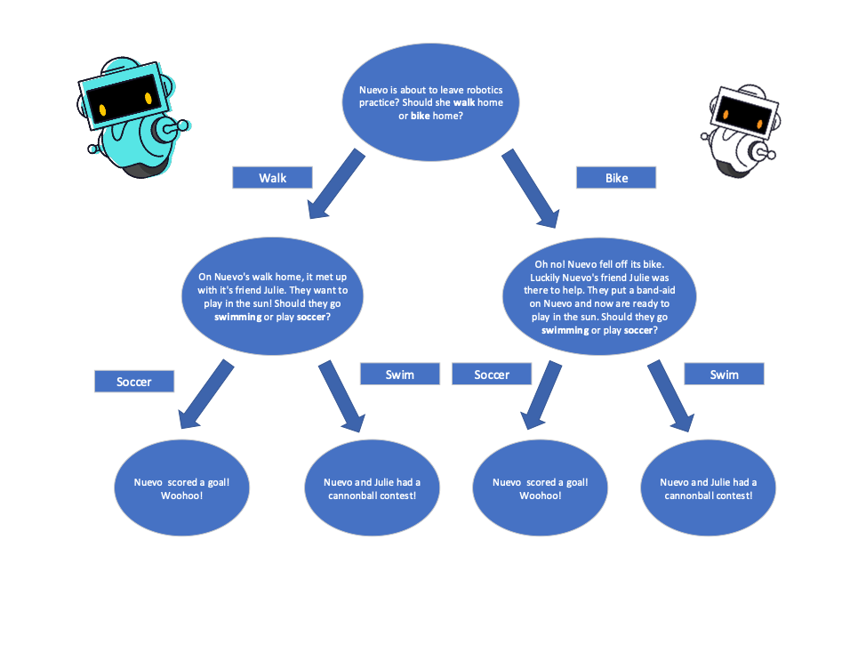

# Part 1 – Welcome!

## Power of Stories

Hi everyone! Today we are going to be using our engineering superpowers to be the best storytellers. Stories are a great way to connect people, share traditions, and learn new things!

Turn to your neighbor and share your favorite story! It can be a story that your family members have shared. Your favorite story line from a Marvel movie or your favorite novel.

Now through code, we get the chance to create or re-tell amazing stories and spread our ideas further!

## Choose Your Own Adventure Games!

Today you will be choosing and designing the plot of the stories that you are being told!
In Choose Your Own Adventure Games you are the protagonist of the story, and you get to choose the actions that the characters are taking and the outcomes of those actions. You have control!

## Demo

Let’s try it out!

<iframe height="600px" width="100%" 
 src="https://repl.it/repls/HeavyWretchedCharactermapping?lite=true&outputonly=1" scrolling="no" frameborder="no" allowtransparency="true" allowfullscreen="true" sandbox="allow-forms allow-pointer-lock allow-popups allow-same-origin allow-scripts allow-modals"></iframe>

What did you all think? We’re now going to learn some cool skills that will allow us to create our own stories.

# Part 2 – Let’s Get Started!

## Starting Up

Open your favorite internet browser (such as Edge, Firefox, Google Chrome, Internet Explorer) and go to https://repl.it. Scroll to the bottom of the page, look for ‘languages’, search for Python and click it.

You should see something like the following screen:

We will ignore some of the details on this screen, but we will go over some of the basics that show up. The **main.py** file contains code, or instructions for the computer to run. Anything that results from running the code will be displayed on the right side. This window is called the console.

## Writing to Console (Printing)

Let’s start by doing a print statement. A print statement allows you to take control of the computer and make it print something out!

To start, copy and paste this text in your Repl.it window:

**print("HelloWorld!")**

Hit **run** and watch your console say ”Hello, World!” on the screen to the right! **print** tells the computer to print the sentence within the parentheses () into the console, or the screen on the right.

Note: The RUN button looks like this:

**HELP!** I got a lot of red text!

**If you see any red text, you have encountered some errors! Please ask for help or check the debugging page at the end of this tutorial.** In particular, beware of the following when coding in Python:

1. Make sure the sentence you wish to print is **surrounded in quotation marks** and that the sentence is **inside the parentheses**.
   
2. Spacing in Python is very important. Make sure you don’t have any unnecessary spaces or tabs at the beginning or at the end of each line, as Python won’t be able to read the code otherwise. For example, don’t put any spaces before **print**, or any spaces after the last parenthesis in **print("Hello, World!)**.

## Activity 1

1. Without removing the quotation marks, try changing **"Hello, World"** to another sentence. (For example – "My name is Nuvi!") Press **run** to see if anything changes.
2. Add another print below the current line to print a second sentence below the first sentence.
3. Press **run** to see if two sentences are printed out.

{} We will use printing a lot in the later lessons, so make sure you understand this before continuing! {}

## Comments

If at any time during this activity, you wish to write notes to help you understand the code, you can use the # symbol to create a comment. Any text after the # symbol will be ignored by the computer. Try adding a comment above your first line of code and press **run**. You will see that the computer will ignore your comment.

#This is my first line of code
print("Hello,world!)

Be careful, if you remove the # symbol, your code will not work!

## The Basics

## Strings

Anything that is surrounded by quotation marks is called a **string**. This is how a computer represents words or sentences. For example, **"a", "2", "banana!", and "Hello World"** are strings, but _2_ and _Hello World_ are not strings, because the quotation marks are missing.

You can combine many strings together using the + sign.

For example:

- "Apple" + "Pineapple" produces the string "ApplePineapple".
- "Nuevo" + " " + "Foundation" produces the string "Nuevo Foundation".

What if you wanted to combine your first and last name? How would you do that?

## Activity 2

Delete all the **print** statements in your code. Start your code with the line print("Nuevo" + " " + "Foundation")

If you run it, you should get the following output:

    Nuevo Foundation

Let’s try and find two more ways to print the string "Nuevo Foundation" using two plus (+) symbols in each **print** statement. Once you make this work, you should have "Nuevo Foundation" printed out 3 times. In other words, your console should look like this after you press run:
Nuevo Foundation
Nuevo Foundation
Nuevo Foundation

{} Hint: The strings that you combine do not have to be real words! For example, "Ap" + "ple" will produce the string "Apple". Ask for help if you are confused {}

## Variables

**Variables** are simply names that we can give to values such as strings, numbers, and booleans. Here’s how to make a variable named s. We say s is a string that has the value "Hello, World!". Can you describe the following variables?

    s = "Hello, World!"
    x = 88
    happy = True

Press **run**.

Note that variables are not printed out to the console. Instead, the variable simply saves the string, number, or boolean into the computer’s memory. We can use these variables in other statements. For example, the following code would print "Hello Nuevo Foundation" to the console:

    str1 = "Hello"
    str2 = "Nuevo Foundation"
    print(str1 + " " + str2)

You can also do the following to print strings together while adding spaces in between the words.

    str1 = "Hello"
    str2 = "Nuevo Foundation"
    print(str1, str2)

## Activity 3

- Create two new variables: A variable named **comp** that stores the string **"Computer"**.
- A variable named **five** that stores the number **5**.

Next, use the variables and what you learned in the previous activities to **print** out the following to the console. You _must_ use the variables!

    Computer
    5
    ComputerComputer
    10
    ComputerComputerComputer
    15

{} Hint: If you’re stuck, consider using the + operator. Remember that you can use the variables comp and **five** multiple times in the same line! {}

## Reading from the Console

Now that we know the basics about variables, we can ask for input from the user. Use the following line to tell our program to wait until the user types something into the console. Then, the computer takes whatever is typed into the console, and stores it into the variable called **value**.
value = input()

Here’s an example of how to use **input()** to accept user input:

    print("What's your name?")
    value = input()
    print("Hello " + value + "!")

Give this a try! When you hit **run**, you’ll notice that the  doesn’t appear on the console yet. See below.

This is because the program is waiting for you to type something in. Enter your name or ‘Nuvi’ into the console on the right, press _Enter_, and check that it prints out correctly.

{} Note: Even if we type in a number, such as 8, the variable value will contain the string "8". Be careful when attempting to do math on input variables! {}

## Activity 4

Let’s see if we can write a program that first prints the following two lines to console:

    Welcome!
    How can I help you today?

Afterwards, the console waits for user input. After the user types something in the console and presses _Enter_, the computer prints out:

    You asked: [input]?
    I don’t know the answer to [input]. Goodbye!

[input] should be replaced with whatever the user had typed into the console. For example, if you wanted to ask “How old am I?”, the computer will print out that it doesn’t know the answer to that.

{} Hint: This is very similar to the example that we went through together above. Try making some small changes from what we have already given you. {}

## Conditional Statements

Now that we know the basics of print statements, variables, and reading in input from the user – we can combine all these awesome skills with conditional statements. Conditional statements allow the computer to make **decisions** based off the **value** of an expression. In the real world, we use conditional statements all the time to make decisions! For example, if it is raining outside, then I use an umbrella. In this example, the I evaluated the weather outside and because it was raining, I made the sequential decision to use an umbrella.

What conditional statements can you think of that you use in everyday life?

## If-Statements

We’ll start off with an if statement in its simplest form!

Shown above we have three different parts:

1. If – this tells the computer that we are going to deciding based off the expression inside the parenthesis
2. Expr – this represents the expression that we are evaluating. If the expression is “truthful” then the computer will enter the if statement and execute the statement.
3. Statement – what the computer will complete if the expression is “truthful”

Let’s break down the example above and decide why some statements are “truthful” or “falsy”.

We are given to variables “x” and “y” are they are assigned two values. In the first if statement we are testing if the value of x is less than the value of y. Since 0 is less than 5, this is true! So, the first if- statement will print yes.

However, we can see that y is not less than x, so it evaluates to false. The inside of the if statement will not be executed then. The same applies for the if statement evaluating if x is equal to 10. We see that x is equal to 0, so this expression is false, and the inside of the if statement won’t be executed.

## Else - Statements

Now that we know how to use if statements to conditionally execute a single statement or multiple statements, let’s see what **else** we can do!

Sometimes, you need to evaluate a condition in order to act accordingly if it is true, but if it false we act differently. Here is the simplest form of the else statement.

This is really like the if statement! However here, if the if statement is false **(not truthful)** the program will automatically execute the statment2 in the else statement.
A real-life example is if I’m hungry, I’ll eat. But if I’m not hungry, I won’t eat. Let’s take a look in python code!

## Activity 5

Let’s put it all together! Let’s see if we can create a program that takes prompts the user for their name. The user can write their name into the console. Then the computer can decide if their name is equal to your name, print out a response. Else, print out a different response!

<iframe height="400px" width="100%" src="https://repl.it/repls/SmugExcitingIntegers?lite=true" scrolling="no" frameborder="no" allowtransparency="true" allowfullscreen="true" sandbox="allow-forms allow-pointer-lock allow-popups allow-same-origin allow-scripts allow-modals"></iframe>

{} Hint: Try talking out the different paths to a computer can take! Make sure to identify what the if and else conditions are. {}

# Part 3 - Time to Create

## Overview

It’s time to start creating our own stories with all the skills we’ve learned today! The question that we are tackling today is how to get the audience involved with the story line, and the answer to this is CODE!

## Section 1: Story Boarding

To get started, pull out a piece a paper and start “story boarding”. What does that mean? In order to develop a great story that allows the reader to choose between options, one can outline the flow of their story. This is a great planning step, that will you help you tremendously once you start coding!
I would start with the 3 or 4 main choices your protagonist is going to make in the story. From there draw arrows for how the different choices your protagonist makes effects the story.

### Nuevo’s Example

Here an example of how to story board!
The 4 main choices the protagonist will make is:

1. Will she walk home from Robotics practice?
2. Will she ride a bicycle home from Robotics practice?
3. Will she play soccer with her friends at home?
4. Will she go swimming with her friends at home?

Here is the resulting story board:

Now, it’s great to mark up the different section of story board to match with different coding concepts that we’ve learned. If our story needs to make decision, our code we use **if-else** statements. If we are asking the audience to give us input to make decisions in our story, we will use **user input**. The actual story that the audience will be reading is **string variables**!

Let’s mark it up on the story board! Here is what it looks like:

It’s really helpful to annotate your story board so you know what code related topics we can use! We see that the story line will be comprised off text or **string variables**. The **user-input** can be the reader typing whether they want to “walk” or “bike” or choose “soccer” or “swim”. The user can choose their story based off the input they give to the computer! The different paths that Nuevo can take are a series of decisions. Luckily, we learned how to use **if – else statements**, so the Nuevo can easily choose different paths the story can take!

## Section 2: Transferring the Story Board to Code!

It’s time to open repl.it. Now it is time to create, let’s get creative!

You can continue working off Nuevo’s story line: <iframe height="400px" width="100%" src="https://repl.it/repls/IdleWarpedRatio?lite=true" scrolling="no" frameborder="no" allowtransparency="true" allowfullscreen="true" sandbox="allow-forms allow-pointer-lock allow-popups allow-same-origin allow-scripts allow-modals"></iframe>

You can work on a template for a Choose Your Own Adventure game: <iframe height="400px" width="100%" src="https://repl.it/repls/FortunateStingyOctagons?lite=true" scrolling="no" frameborder="no" allowtransparency="true" allowfullscreen="true" sandbox="allow-forms allow-pointer-lock allow-popups allow-same-origin allow-scripts allow-modals"></iframe>

Or you can start from scratch and make it your own! Just go to repl.it and start story telling!
